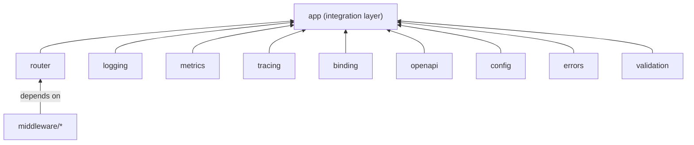

This page explains how Rivaas is structured — the module layout, package boundaries, and the rules that keep everything clean. For the principles that drive these decisions, see [Design Principles](../design-principles/). For the reasoning behind specific choices, see [Design Decisions](../design-decisions/).

## Multi-Module Architecture

Rivaas is a monorepo with many independent Go modules. A `go.work` file at the root ties them together for development, but each module has its own `go.mod` and can be versioned and released on its own.

The workspace includes:

- **Framework modules** — `app/`, `router/`
- **Cross-cutting modules** — `binding/`, `config/`, `errors/`, `logging/`, `metrics/`, `tracing/`, `validation/`, `openapi/`
- **Middleware modules** — `middleware/accesslog`, `middleware/cors`, `middleware/ratelimit`, `middleware/recovery`, and more (each is its own module)
- **Subpackages** — `router/version/`, `router/compiler/`, and internal packages within modules

This structure gives you:

- **Independent versioning** — A bug fix in `logging` doesn't force a new release of `metrics`
- **Minimal dependency graphs** — `go get rivaas.dev/logging` pulls only what `logging` needs
- **Compiler-enforced boundaries** — If a standalone package accidentally imports `app`, the build fails

## Dependency Rules

Rivaas enforces a strict dependency direction. Standalone packages never import `app`. The `app` package imports standalone packages, not the other way around. Middleware modules depend only on `router`.



The arrows point in the direction of "is imported by." Standalone packages sit at the bottom; `app` sits at the top.

## Separation of Concerns

Each package does one thing well. This makes the code easier to test, maintain, and understand.

| Package | What it does |
|---------|--------------|
| `router` | Routes HTTP requests to handlers |
| `metrics` | Collects and exports metrics |
| `tracing` | Tracks requests across services |
| `logging` | Writes structured log messages |
| `binding` | Converts request data to Go structs |
| `validation` | Checks if data is valid |
| `errors` | Formats error responses (RFC 9457) |
| `openapi` | Generates API documentation |
| `config` | Loads and validates configuration from multiple sources |
| `app` | Connects everything together |

Packages talk through clean interfaces. They don't know about each other's internal details.

```go
type Recorder struct { ... }
func (r *Recorder) RecordRequest(method, path string, status int, duration time.Duration)
```

The `app` package calls `RecordRequest` without knowing how the recorder works inside.

## Standalone Packages

**Every Rivaas package works on its own.** You can use any package without the full framework.

**Benefits:**

- **No lock-in** — Use Rivaas packages with any Go framework
- **Gradual adoption** — Start with one package, add more later
- **Easy testing** — Test with minimal dependencies
- **Flexible** — Different services can use different packages

**Requirements for standalone packages:**

Each package must:

1. Work without the `app` package
2. Have its own `go.mod` file
3. Provide `New()` and `MustNew()` constructors
4. Use functional options
5. Have good defaults
6. Include documentation and examples

**Example: Using metrics with the standard library**

```go
package main

import (
    "net/http"
    "rivaas.dev/metrics"
)

func main() {
    recorder := metrics.MustNew(
        metrics.WithPrometheus(":9090", "/metrics"),
        metrics.WithServiceName("my-api"),
    )
    defer recorder.Shutdown(context.Background())

    handler := metrics.Middleware(recorder)(myHandler)
    http.ListenAndServe(":8080", handler)
}
```

Any standalone package follows this same pattern — create with `MustNew()`, use it, and shut it down.

**All standalone packages:**

| Package | Import Path | What it does |
|---------|-------------|--------------|
| `router` | `rivaas.dev/router` | HTTP routing |
| `metrics` | `rivaas.dev/metrics` | Prometheus/OTLP metrics |
| `tracing` | `rivaas.dev/tracing` | OpenTelemetry tracing |
| `logging` | `rivaas.dev/logging` | Structured logging |
| `binding` | `rivaas.dev/binding` | Request binding |
| `validation` | `rivaas.dev/validation` | Input validation |
| `errors` | `rivaas.dev/errors` | Error formatting (RFC 9457) |
| `openapi` | `rivaas.dev/openapi` | API documentation |
| `config` | `rivaas.dev/config` | Multi-source configuration |

## Middleware as Independent Modules

Each middleware is its own Go module with its own `go.mod`. Middleware modules depend only on `router` — they never import `app` or other standalone packages.

This means:

- You import only the middleware you need
- The dependency footprint stays minimal
- Adding a new middleware doesn't affect existing ones

Available middleware modules include `accesslog`, `basicauth`, `bodylimit`, `compression`, `cors`, `methodoverride`, `ratelimit`, `recovery`, `requestid`, `security`, `timeout`, and `trailingslash`.

## The App Package: Integration Layer

The `app` package is the glue that connects standalone packages into a complete framework.

**What app does:**

1. **Connects packages** — Wires standalone packages together
2. **Manages lifecycle** — Handles startup, shutdown, and cleanup
3. **Shares configuration** — Passes service name and version to all packages
4. **Provides defaults** — Sets up everything for production use
5. **Makes it easy** — One entry point for common use cases
6. **Configures server transport** — HTTP, HTTPS, or mTLS via [WithTLS](/docs/reference/packages/app/options/#withtls) / [WithMTLS](/docs/reference/packages/app/options/#withmtls) at construction; a single `Start(ctx)` runs the server. Default port is 8080 for HTTP and 8443 for TLS/mTLS, overridable with `WithPort`.

When building route handler chains (for both groups and version groups), the app layer uses a single handler type (`router.HandlerFunc`) so the integration layer stays consistent and predictable.

**How app connects packages:**

```go
import (
    "rivaas.dev/errors"
    "rivaas.dev/logging"
    "rivaas.dev/metrics"
    "rivaas.dev/openapi"
    "rivaas.dev/router"
    "rivaas.dev/tracing"
)

type App struct {
    router  *router.Router
    metrics *metrics.Recorder
    tracing *tracing.Config
    logging *logging.Config
    openapi *openapi.Manager
    // ...
}
```

**Automatic wiring:**

When you use `app`, packages connect automatically:

```go
app := app.MustNew(
    app.WithServiceName("my-api"),
    app.WithObservability(
        app.WithLogging(logging.WithJSONHandler()),
        app.WithMetrics(),
        app.WithTracing(tracing.WithOTLP("localhost:4317")),
    ),
)
```

Behind the scenes, `app` creates each package with the shared service name, connects the logger to metrics and tracing, sets up unified observability, and configures graceful shutdown for all components.

**Choose your level:**

```go
// Full framework (recommended for most)
app := app.MustNew(
    app.WithServiceName("my-api"),
    app.WithObservability(
        app.WithLogging(),
        app.WithMetrics(),
        app.WithTracing(),
    ),
)
app.GET("/users", handlers.ListUsers)
app.Start(ctx)

// Standalone packages (for maximum control)
r := router.MustNew()
logger := logging.MustNew()
recorder := metrics.MustNew()

r.Use(loggingMiddleware(logger))
r.Use(metricsMiddleware(recorder))
r.GET("/users", listUsers)
http.ListenAndServe(":8080", r)
```

### Lifecycle Management

The `app` package provides lifecycle hooks that run at specific points during the application's life:

- **`OnStart`** — Runs before the server starts listening. Use for initialization that must succeed (database connections, migrations). Hooks run in order; if any hook returns an error, startup stops.
- **`OnReady`** — Runs after the server is ready to accept requests. Use for notifications or health check readiness.
- **`OnReload`** — Runs when the application receives a reload signal. Use for refreshing configuration.
- **`OnShutdown`** — Runs when the server is stopping. Hooks run in LIFO (last-in, first-out) order for clean teardown.
- **`OnStop`** — Runs on best-effort basis after shutdown completes.

```go
app.OnStart(func(ctx context.Context) error {
    return db.PingContext(ctx)
})

app.OnShutdown(func(ctx context.Context) {
    db.Close()
})
```

Graceful shutdown handles in-flight requests, drains connections, and runs shutdown hooks — all managed by `Start(ctx)`.

## Observability Architecture

The router provides observability through the `ObservabilityRecorder` interface. This is an inversion-of-control hook: the router calls into observability code without importing any observability package.

```go
type ObservabilityRecorder interface {
    OnRequestStart(ctx context.Context, req *http.Request) (context.Context, any)
    WrapResponseWriter(w http.ResponseWriter, state any) http.ResponseWriter
    OnRequestEnd(ctx context.Context, state any, writer http.ResponseWriter, routePattern string)
}
```

The lifecycle works in three steps:

1. **OnRequestStart** — Called before routing. Returns an enriched context (e.g., with a trace span) and an opaque state token. If the request should be excluded from observability (e.g., health checks), the state is `nil`.
2. **WrapResponseWriter** — Wraps the response writer to capture status code and response size. Skipped when state is `nil`.
3. **OnRequestEnd** — Called after the handler finishes. Records metrics, finishes traces, writes access logs. Skipped when state is `nil`.

Context enrichment (step 1) always happens, even for excluded paths. This means trace propagation works for downstream calls from health check handlers.

The `app` package provides a default implementation that combines metrics, tracing, and access logging into a single recorder.

## API Versioning

The `router/version` package provides API version detection and lifecycle header management. The `version.Engine` detects which API version a request targets by checking configurable sources (headers, query parameters, etc.) in order.

```go
engine := version.MustNew(
    version.WithHeaderDetection("X-API-Version"),
    version.WithDefault("v1"),
)
```

When integrated with the router, version detection happens automatically and the detected version is available to handlers. The engine also manages lifecycle headers for version deprecation and sunset dates.
