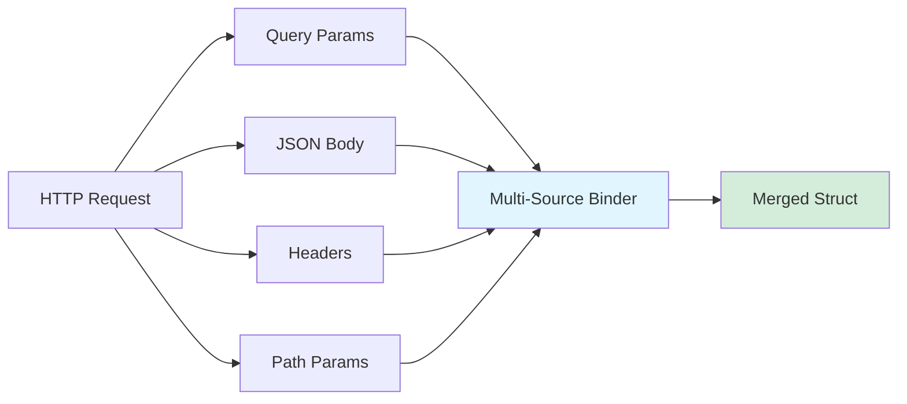

Learn how to bind data from multiple sources. This includes query parameters, JSON body, and headers. Configure precedence rules for flexible request handling.

## Concept Overview

Multi-source binding allows you to populate a single struct from multiple request sources. It uses clear precedence rules:



## Basic Multi-Source Binding

Use `binding.Auto()` to bind from query, body, and headers automatically:

```go
type UserRequest struct {
    // From query or JSON body
    Username string `json:"username" query:"username"`
    Email    string `json:"email" query:"email"`
    
    // From header
    APIKey   string `header:"X-API-Key"`
}

// Works with:
// - POST /users?username=john with JSON body
// - GET /users?username=john&email=john@example.com
// - Headers: X-API-Key: secret123

req, err := binding.Auto[UserRequest](r)
```

## Custom Multi-Source

Build custom multi-source binding with explicit precedence:

```go
type SearchRequest struct {
    Query    string   `query:"q" json:"query"`
    Page     int      `query:"page" default:"1"`
    PageSize int      `query:"page_size" default:"20"`
    Filters  []string `json:"filters"`
    SortBy   string   `header:"X-Sort-By" default:"created_at"`
}

// Bind from multiple sources
req, err := binding.Multi[SearchRequest](
    binding.WithQuery(r.URL.Query()),
    binding.WithJSON(r.Body),
    binding.WithHeaders(r.Header),
)
```

## Precedence Rules

By default, sources are applied in order (last wins):

```go
// Example: User ID from multiple sources
type Request struct {
    UserID int `query:"user_id" json:"user_id" header:"X-User-ID"`
}

// Query: ?user_id=1
// JSON:  {"user_id": 2}
// Header: X-User-ID: 3

// Default precedence (last wins):
req, err := binding.Multi[Request](
    binding.WithQuery(r.URL.Query()),      // user_id = 1
    binding.WithJSON(r.Body),              // user_id = 2 (overwrites)
    binding.WithHeaders(r.Header),         // user_id = 3 (overwrites)
)
// Result: user_id = 3
```

## First-Wins Precedence

Use `WithMergeStrategy` to prefer first non-empty value:

```go
req, err := binding.Multi[Request](
    binding.WithMergeStrategy(binding.MergeFirstWins),
    binding.WithQuery(r.URL.Query()),      // user_id = 1
    binding.WithJSON(r.Body),              // user_id = 2 (ignored)
    binding.WithHeaders(r.Header),         // user_id = 3 (ignored)
)
// Result: user_id = 1
```

## Partial Binding

Different fields can come from different sources:

```go
type CompleteRequest struct {
    // Pagination from query
    Page     int `query:"page" default:"1"`
    PageSize int `query:"page_size" default:"20"`
    
    // Search criteria from JSON body
    Filters struct {
        Category string   `json:"category"`
        Tags     []string `json:"tags"`
        MinPrice float64  `json:"min_price"`
        MaxPrice float64  `json:"max_price"`
    } `json:"filters"`
    
    // Auth from headers
    APIKey    string `header:"X-API-Key"`
    RequestID string `header:"X-Request-ID"`
}

// POST /search?page=2&page_size=50
// Headers: X-API-Key: secret, X-Request-ID: req-123
// Body: {"filters": {"category": "electronics", "tags": ["sale"]}}

req, err := binding.Multi[CompleteRequest](
    binding.WithQuery(r.URL.Query()),
    binding.WithJSON(r.Body),
    binding.WithHeaders(r.Header),
)
```

## Path Parameters

Combine with router path parameters:

```go
type UserUpdateRequest struct {
    // From path: /users/:id
    UserID int `path:"id"`
    
    // From JSON body
    Username string `json:"username"`
    Email    string `json:"email"`
    
    // From header
    APIKey string `header:"X-API-Key"`
}

// With gorilla/mux or chi
req, err := binding.Multi[UserUpdateRequest](
    binding.WithPath(mux.Vars(r)),  // or chi.URLParams(r)
    binding.WithJSON(r.Body),
    binding.WithHeaders(r.Header),
)
```

## Form Data and JSON

Handle both form and JSON submissions:

```go
type LoginRequest struct {
    Username string `json:"username" form:"username"`
    Password string `json:"password" form:"password"`
}

// Works with both:
// Content-Type: application/json
// Content-Type: application/x-www-form-urlencoded

req, err := binding.Auto[LoginRequest](r)
```

## Source-Specific Options

Apply options to specific sources:

```go
req, err := binding.Multi[Request](
    binding.WithQuery(r.URL.Query()),
    
    binding.WithJSON(r.Body,
        binding.WithMaxBytes(1024*1024),
        binding.WithDisallowUnknownFields(),
    ),
    
    binding.WithHeaders(r.Header),
)
```

## Conditional Sources

Bind from sources based on conditions:

```go
func BindRequest[T any](r *http.Request) (T, error) {
    sources := []binding.Source{
        binding.WithQuery(r.URL.Query()),
    }
    
    // Add JSON source only for POST/PUT/PATCH
    if r.Method != "GET" && r.Method != "DELETE" {
        sources = append(sources, binding.WithJSON(r.Body))
    }
    
    // Add auth header if present
    if r.Header.Get("Authorization") != "" {
        sources = append(sources, binding.WithHeaders(r.Header))
    }
    
    return binding.Multi[T](sources...)
}
```

## Complex Example

Real-world multi-source scenario:

```go
type ProductSearchRequest struct {
    // Query parameters (user input)
    Query    string   `query:"q"`
    Page     int      `query:"page" default:"1"`
    PageSize int      `query:"page_size" default:"20"`
    SortBy   string   `query:"sort_by" default:"relevance"`
    
    // Advanced filters (JSON body)
    Filters struct {
        Categories []string `json:"categories"`
        Brands     []string `json:"brands"`
        MinPrice   float64  `json:"min_price"`
        MaxPrice   float64  `json:"max_price"`
        InStock    *bool    `json:"in_stock"`
        Rating     *int     `json:"min_rating"`
    } `json:"filters"`
    
    // Request metadata (headers)
    Locale      string `header:"Accept-Language" default:"en-US"`
    Currency    string `header:"X-Currency" default:"USD"`
    UserAgent   string `header:"User-Agent"`
    RequestID   string `header:"X-Request-ID"`
    
    // Internal fields (not from request)
    UserID      int    `binding:"-"`  // Set after auth
    RequestedAt time.Time `binding:"-"`
}

func SearchProducts(w http.ResponseWriter, r *http.Request) {
    // Bind from multiple sources
    req, err := binding.Multi[ProductSearchRequest](
        binding.WithQuery(r.URL.Query()),
        binding.WithJSON(r.Body, binding.WithMaxBytes(1024*1024)),
        binding.WithHeaders(r.Header),
    )
    if err != nil {
        http.Error(w, err.Error(), http.StatusBadRequest)
        return
    }
    
    // Set internal fields
    req.UserID = getUserID(r)
    req.RequestedAt = time.Now()
    
    // Execute search
    results := executeSearch(req)
    json.NewEncoder(w).Encode(results)
}
```

## Error Handling

Multi-source errors include source information:

```go
req, err := binding.Multi[Request](
    binding.WithQuery(r.URL.Query()),
    binding.WithJSON(r.Body),
)
if err != nil {
    var bindErr *binding.BindError
    if errors.As(err, &bindErr) {
        log.Printf("Source: %s, Field: %s, Error: %v",
            bindErr.Source, bindErr.Field, bindErr.Err)
    }
    
    http.Error(w, err.Error(), http.StatusBadRequest)
    return
}
```

## Source Priority Pattern

Common pattern for API versioning and backward compatibility:

```go
type VersionedRequest struct {
    // Prefer header, fallback to query
    APIVersion string `header:"X-API-Version" query:"api_version" default:"v1"`
    
    // Prefer body, fallback to query
    UserID int `json:"user_id" query:"user_id"`
}

// With first-wins strategy:
req, err := binding.Multi[VersionedRequest](
    binding.WithMergeStrategy(binding.MergeFirstWins),
    binding.WithHeaders(r.Header),   // Highest priority
    binding.WithQuery(r.URL.Query()), // Fallback
    binding.WithJSON(r.Body),         // Lowest priority
)
```

## Middleware Pattern

Create reusable binding middleware:

```go
func BindMiddleware[T any](next http.HandlerFunc) http.HandlerFunc {
    return func(w http.ResponseWriter, r *http.Request) {
        req, err := binding.Multi[T](
            binding.WithQuery(r.URL.Query()),
            binding.WithJSON(r.Body),
            binding.WithHeaders(r.Header),
        )
        if err != nil {
            http.Error(w, err.Error(), http.StatusBadRequest)
            return
        }
        
        // Store in context
        ctx := context.WithValue(r.Context(), "request", req)
        next(w, r.WithContext(ctx))
    }
}

// Usage
http.HandleFunc("/users", BindMiddleware[CreateUserRequest](CreateUserHandler))

func CreateUserHandler(w http.ResponseWriter, r *http.Request) {
    req := r.Context().Value("request").(CreateUserRequest)
    // Use req
}
```

## Integration with Rivaas Router

Seamless integration with `rivaas.dev/router`:

```go
import (
    "rivaas.dev/binding"
    "rivaas.dev/router"
)

type CreateUserRequest struct {
    Username string `json:"username"`
    Email    string `json:"email"`
    APIKey   string `header:"X-API-Key"`
}

r := router.New()

r.POST("/users", func(c *router.Context) error {
    req, err := binding.Multi[CreateUserRequest](
        binding.WithJSON(c.Request().Body),
        binding.WithHeaders(c.Request().Header),
    )
    if err != nil {
        return c.JSON(http.StatusBadRequest, err)
    }
    
    // Use req
    return c.JSON(http.StatusCreated, createUser(req))
})
```

## Performance Considerations

1. **Source order**: Most specific first (headers before query)
2. **Lazy evaluation**: Sources are processed in order
3. **Caching**: Struct info is cached across requests
4. **Zero allocation**: Primitive types use no extra memory

## Best Practices

### 1. Document Source Expectations

```go
// SearchRequest accepts search parameters from multiple sources:
//   - Query: pagination (page, page_size)
//   - JSON body: filters (categories, price range)
//   - Headers: locale, currency
type SearchRequest struct {
    // ...
}
```

### 2. Use Defaults Wisely

```go
type Request struct {
    Page int `query:"page" default:"1"`     // Good
    Sort string `header:"X-Sort" query:"sort" default:"created_at"`  // Good
}
```

### 3. Validate After Binding

```go
req, err := binding.Multi[Request](...)
if err != nil {
    return err
}

// Validate business rules
if err := validation.Validate(req); err != nil {
    return err
}
```

## Troubleshooting

### Values Not Merging

Check tag names match across sources:

```go
// Wrong - different tag names
type Request struct {
    ID int `query:"id" json:"user_id"`  // Won't merge
}

// Correct - same semantic field
type Request struct {
    ID int `query:"id" json:"id"`
}
```

### Unexpected Overwrites

Use first-wins strategy or check source order:

```go
// Last wins (default)
binding.Multi[T](
    binding.WithQuery(...),  // Applied first
    binding.WithJSON(...),   // May overwrite query
)

// First wins (explicit)
binding.Multi[T](
    binding.WithMergeStrategy(binding.MergeFirstWins),
    binding.WithHeaders(...),  // Highest priority
    binding.WithQuery(...),
)
```

## Next Steps

- Learn about [Struct Tags](../struct-tags/) syntax
- Explore [Error Handling](../error-handling/) strategies
- See [Advanced Usage](../advanced-usage/) for custom sources
- Review [Examples](../examples/) for complete patterns

For complete API details, see [API Reference](/reference/packages/binding/api-reference/).
