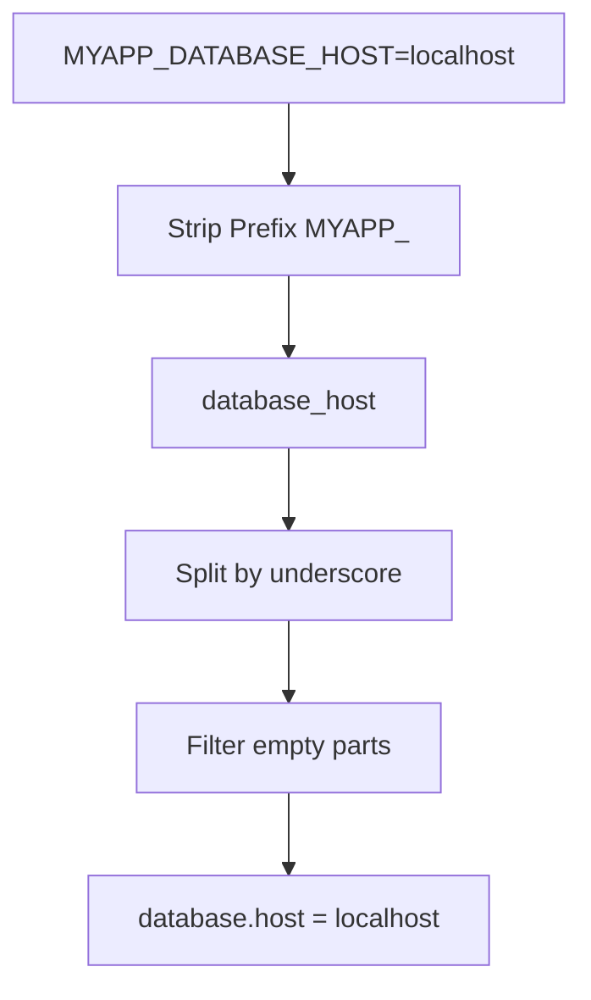

The config package provides powerful environment variable support that automatically maps environment variables to nested configuration structures. This follows the [Twelve-Factor App methodology](https://12factor.net/config) for configuration management.

## Basic Usage

Enable environment variable support with a custom prefix:

```go
cfg := config.MustNew(
    config.WithFile("config.yaml"),
    config.WithEnv("MYAPP_"),  // Only env vars with MYAPP_ prefix
)
```

The prefix helps avoid conflicts with system or other application variables.

## Naming Convention

The config package uses a **hierarchical naming convention** where underscores (`_`) in environment variable names create nested configuration structures.

### Transformation Rules

1. **Strip prefix**: Remove the configured prefix (e.g., `MYAPP_`)
2. **Convert to lowercase**: `DATABASE_HOST` → `database_host`
3. **Split by underscores**: `database_host` → `["database", "host"]`
4. **Filter empty parts**: Consecutive underscores create no extra levels
5. **Create dot notation**: `["database", "host"]` → `database.host`

### Visualization



## Examples

| Environment Variable | Configuration Path | Value |
|---------------------|-------------------|-------|
| `MYAPP_SERVER_PORT` | `server.port` | `8080` |
| `MYAPP_DATABASE_HOST` | `database.host` | `localhost` |
| `MYAPP_DATABASE_USER_NAME` | `database.user.name` | `admin` |
| `MYAPP_FOO__BAR` | `foo.bar` | `value` |
| `MYAPP_A_B_C_D` | `a.b.c.d` | `nested` |

### Basic Example

```bash
export MYAPP_SERVER_HOST=localhost
export MYAPP_SERVER_PORT=8080
export MYAPP_DEBUG=true
```

```go
cfg := config.MustNew(
    config.WithEnv("MYAPP_"),
)
cfg.Load(context.Background())

host := cfg.String("server.host")   // "localhost"
port := cfg.Int("server.port")      // 8080
debug := cfg.Bool("debug")          // true
```

### Nested Configuration

Environment variables naturally create nested structures:

```bash
export MYAPP_DATABASE_PRIMARY_HOST=db1.example.com
export MYAPP_DATABASE_PRIMARY_PORT=5432
export MYAPP_DATABASE_REPLICA_HOST=db2.example.com
export MYAPP_DATABASE_REPLICA_PORT=5432
```

Access nested values:

```go
primaryHost := cfg.String("database.primary.host")  // "db1.example.com"
replicaHost := cfg.String("database.replica.host")  // "db2.example.com"
```

## Struct Field Mapping

When using struct binding, environment variables map directly to struct fields using the `config` tag:

```go
type Config struct {
    Port     int    `config:"port"`
    Host     string `config:"host"`
    Database struct {
        Host     string `config:"host"`
        Port     int    `config:"port"`
        Username string `config:"username"`
        Password string `config:"password"`
    } `config:"database"`
}
```

**Required environment variables:**

```bash
export MYAPP_PORT=8080
export MYAPP_HOST=localhost
export MYAPP_DATABASE_HOST=db.example.com
export MYAPP_DATABASE_PORT=5432
export MYAPP_DATABASE_USERNAME=admin
export MYAPP_DATABASE_PASSWORD=secret123
```

**Usage:**

```go
var appConfig Config
cfg := config.MustNew(
    config.WithEnv("MYAPP_"),
    config.WithBinding(&appConfig),
)

if err := cfg.Load(context.Background()); err != nil {
    log.Fatalf("config error: %v", err)
}

// appConfig is now populated from environment variables
```

## Advanced Nested Structures

For complex applications with deeply nested configuration:

```go
type AppConfig struct {
    Server struct {
        Host string `config:"host"`
        Port int    `config:"port"`
        TLS  struct {
            Enabled  bool   `config:"enabled"`
            CertFile string `config:"cert_file"`
            KeyFile  string `config:"key_file"`
        } `config:"tls"`
    } `config:"server"`
    Database struct {
        Primary struct {
            Host     string `config:"host"`
            Port     int    `config:"port"`
            Database string `config:"database"`
        } `config:"primary"`
        Replica struct {
            Host     string `config:"host"`
            Port     int    `config:"port"`
            Database string `config:"database"`
        } `config:"replica"`
    } `config:"database"`
}
```

**Environment variables:**

```bash
export MYAPP_SERVER_HOST=0.0.0.0
export MYAPP_SERVER_PORT=8080
export MYAPP_SERVER_TLS_ENABLED=true
export MYAPP_SERVER_TLS_CERT_FILE=/etc/ssl/certs/server.crt
export MYAPP_SERVER_TLS_KEY_FILE=/etc/ssl/private/server.key
export MYAPP_DATABASE_PRIMARY_HOST=primary.db.example.com
export MYAPP_DATABASE_PRIMARY_PORT=5432
export MYAPP_DATABASE_PRIMARY_DATABASE=myapp
export MYAPP_DATABASE_REPLICA_HOST=replica.db.example.com
export MYAPP_DATABASE_REPLICA_PORT=5432
export MYAPP_DATABASE_REPLICA_DATABASE=myapp
```

## Edge Cases

### Consecutive Underscores

Multiple consecutive underscores are filtered to prevent empty parts:

```bash
export MYAPP_FOO__BAR=value    # Becomes: foo.bar = "value"
export MYAPP_A___B=value       # Becomes: a.b = "value"
```

### Type Conflicts

If environment variables create conflicts between scalar and nested values, the nested structure takes precedence:

```bash
export MYAPP_FOO=scalar_value
export MYAPP_FOO_BAR=nested_value
# Result: foo.bar = "nested_value" (scalar "foo" is overwritten)
```

### Whitespace Handling

Keys and values are automatically trimmed:

```bash
export MYAPP_KEY="  value  "   # Becomes: key = "value"
```

## Best Practices

### 1. Use Descriptive Prefixes

Always use application-specific prefixes to avoid conflicts:

```bash
# Good - Application-specific
export MYAPP_DATABASE_HOST=localhost
export WEBAPP_DATABASE_HOST=localhost

# Avoid - Too generic
export DATABASE_HOST=localhost
```

### 2. Consistent Naming

Use consistent patterns across your application:

```bash
# Consistent pattern
export MYAPP_SERVER_HOST=localhost
export MYAPP_SERVER_PORT=8080
export MYAPP_SERVER_TIMEOUT=30s
```

### 3. Document Your Variables

Document required and optional environment variables:

```bash
# Required environment variables:
# MYAPP_SERVER_HOST - Server hostname (default: localhost)
# MYAPP_SERVER_PORT - Server port (default: 8080)
# MYAPP_DATABASE_HOST - Database hostname (required)
# MYAPP_DATABASE_PORT - Database port (default: 5432)
```

### 4. Validate Configuration

Use struct validation to ensure required variables are set:

```go
func (c *Config) Validate() error {
    if c.Server.Host == "" {
        return errors.New("MYAPP_SERVER_HOST is required")
    }
    if c.Server.Port <= 0 {
        return errors.New("MYAPP_SERVER_PORT must be positive")
    }
    return nil
}
```

## Merging with Other Sources

Environment variables can override file-based configuration:

```go
cfg := config.MustNew(
    config.WithFile("config.yaml"),      // Base configuration
    config.WithFile("config.prod.yaml"), // Production overrides
    config.WithEnv("MYAPP_"),            // Environment overrides all files
)
```

**Source precedence**: Later sources override earlier ones. Environment variables, being last, have the highest priority.

## Complete Example

```go
package main

import (
    "context"
    "log"
    "rivaas.dev/config"
)

type AppConfig struct {
    Server struct {
        Host string `config:"host"`
        Port int    `config:"port"`
    } `config:"server"`
    Database struct {
        Host     string `config:"host"`
        Port     int    `config:"port"`
        Username string `config:"username"`
        Password string `config:"password"`
    } `config:"database"`
}

func (c *AppConfig) Validate() error {
    if c.Database.Host == "" {
        return errors.New("database host is required")
    }
    if c.Database.Username == "" {
        return errors.New("database username is required")
    }
    return nil
}

func main() {
    var appConfig AppConfig
    
    cfg := config.MustNew(
        config.WithFile("config.yaml"),  // Base config
        config.WithEnv("MYAPP_"),        // Override with env vars
        config.WithBinding(&appConfig),
    )

    if err := cfg.Load(context.Background()); err != nil {
        log.Fatalf("failed to load config: %v", err)
    }

    log.Printf("Server: %s:%d", appConfig.Server.Host, appConfig.Server.Port)
    log.Printf("Database: %s:%d", appConfig.Database.Host, appConfig.Database.Port)
}
```

## Next Steps

- Learn [Struct Binding](../struct-binding/) for automatic config mapping
- Explore [Multiple Sources](../multiple-sources/) for advanced merging strategies
- See [Validation](../validation/) to ensure configuration correctness

For technical details on the environment variable codec, see [Codecs Reference](/reference/packages/config/codecs/).
