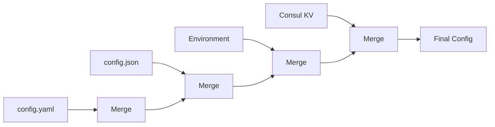

The config package supports loading configuration from multiple sources simultaneously. This enables powerful patterns like base configuration with environment-specific overrides.

## Source Precedence

When multiple sources are configured, later sources override earlier ones:

```go
cfg := config.MustNew(
    config.WithFile("config.yaml"),      // Base configuration
    config.WithFile("config.prod.yaml"), // Production overrides
    config.WithEnv("MYAPP_"),            // Environment overrides all
)
```

**Priority:** Environment variables > `config.prod.yaml` > `config.yaml`

### Visualization



## Hierarchical Merging

Sources are merged hierarchically - nested structures are combined intelligently:

**config.yaml (base):**

```yaml
server:
  host: localhost
  port: 8080
  timeout: 30s
database:
  host: localhost
  port: 5432
```

**config.prod.yaml (overrides):**

```yaml
server:
  host: 0.0.0.0
database:
  host: db.example.com
```

**Merged result:**

```yaml
server:
  host: 0.0.0.0      # Overridden.
  port: 8080         # From base.
  timeout: 30s       # From base.
database:
  host: db.example.com  # Overridden.
  port: 5432            # From base.
```

## File Sources

Load configuration from local files:

```go
cfg := config.MustNew(
    config.WithFile("config.yaml"),
    config.WithFile("config.json"),
    config.WithFile("config.toml"),
)
```

### Format Auto-Detection

File formats are detected automatically from extensions:

```go
config.WithFile("app.yaml")  // YAML
config.WithFile("app.yml")   // YAML
config.WithFile("app.json")  // JSON
config.WithFile("app.toml")  // TOML
```

### Explicit Format

Specify format explicitly when needed:

```go
config.WithFileSource("config.txt", codec.TypeYAML)
config.WithFileSource("data.conf", codec.TypeJSON)
```

## Environment Variable Sources

Load configuration from environment variables:

```go
cfg := config.MustNew(
    config.WithFile("config.yaml"),
    config.WithEnv("MYAPP_"),  // Prefix filter
)
```

Environment variables override file-based configuration. See [Environment Variables](../environment-variables/) for detailed naming conventions.

## Content Sources

Load configuration from byte slices (useful for testing or dynamic configuration):

```go
configData := []byte(`{
    "server": {
        "port": 8080,
        "host": "localhost"
    }
}`)

cfg := config.MustNew(
    config.WithContentSource(configData, codec.TypeJSON),
)
```

### Use Cases for Content Sources

**Testing:**

```go
func TestConfig(t *testing.T) {
    testConfig := []byte(`port: 8080`)
    cfg := config.MustNew(
        config.WithContentSource(testConfig, codec.TypeYAML),
    )
    cfg.Load(context.Background())
    
    assert.Equal(t, 8080, cfg.Int("port"))
}
```

**Dynamic Configuration:**

```go
// Configuration from HTTP response
resp, _ := http.Get("https://config-server/config.json")
configBytes, _ := io.ReadAll(resp.Body)

cfg := config.MustNew(
    config.WithContentSource(configBytes, codec.TypeJSON),
)
```

## Remote Sources

### Consul

Load configuration from HashiCorp Consul:

```go
cfg := config.MustNew(
    config.WithConsul("production/service"),
)
```


The Consul source automatically looks up `CONSUL_HTTP_ADDR` and `CONSUL_HTTP_TOKEN` environment variables. You can override these by setting the appropriate environment variables.


**Environment variables for Consul:**

```bash
export CONSUL_HTTP_ADDR=consul.example.com:8500
export CONSUL_HTTP_TOKEN=secret-token
```

**Loading from Consul:**

```go
cfg := config.MustNew(
    config.WithFile("config.yaml"),           // Local defaults
    config.WithConsul("staging/myapp.json"),  // Staging overrides
    config.WithEnv("MYAPP_"),                 // Environment overrides
)
```

The format is auto-detected from the key path extension (`.json`, `.yaml`, `.toml`).

## Custom Sources

Implement custom sources for any data source:

```go
type Source interface {
    Load(ctx context.Context) (map[string]any, error)
}
```

### Example: Database Source

```go
type DatabaseSource struct {
    db *sql.DB
}

func (s *DatabaseSource) Load(ctx context.Context) (map[string]any, error) {
    rows, err := s.db.QueryContext(ctx, "SELECT key, value FROM config")
    if err != nil {
        return nil, err
    }
    defer rows.Close()
    
    config := make(map[string]any)
    for rows.Next() {
        var key, value string
        if err := rows.Scan(&key, &value); err != nil {
            return nil, err
        }
        config[key] = value
    }
    
    return config, nil
}

// Usage
cfg := config.MustNew(
    config.WithSource(&DatabaseSource{db: db}),
)
```

### Example: HTTP Source

```go
type HTTPSource struct {
    url   string
    codec codec.Codec
}

func (s *HTTPSource) Load(ctx context.Context) (map[string]any, error) {
    req, _ := http.NewRequestWithContext(ctx, "GET", s.url, nil)
    resp, err := http.DefaultClient.Do(req)
    if err != nil {
        return nil, err
    }
    defer resp.Body.Close()
    
    data, err := io.ReadAll(resp.Body)
    if err != nil {
        return nil, err
    }
    
    var config map[string]any
    if err := s.codec.Decode(data, &config); err != nil {
        return nil, err
    }
    
    return config, nil
}

// Usage
cfg := config.MustNew(
    config.WithSource(&HTTPSource{
        url:   "https://config-server/config.json",
        codec: codec.JSON{},
    }),
)
```

## Multi-Environment Pattern

A common pattern for handling multiple environments:

```go
package main

import (
    "context"
    "log"
    "os"
    "rivaas.dev/config"
)

func loadConfig() *config.Config {
    env := os.Getenv("APP_ENV")
    if env == "" {
        env = "development"
    }
    
    cfg := config.MustNew(
        config.WithFile("config.yaml"),              // Base config
        config.WithFile("config."+env+".yaml"),      // Environment-specific
        config.WithEnv("MYAPP_"),                    // Environment variables
    )
    
    if err := cfg.Load(context.Background()); err != nil {
        log.Fatalf("failed to load config: %v", err)
    }
    
    return cfg
}

func main() {
    cfg := loadConfig()
    // Use configuration
}
```

**File structure:**

```
config.yaml           # Base configuration
config.development.yaml
config.staging.yaml
config.production.yaml
```

## Dumping Configuration

Save the effective merged configuration to a file:

```go
cfg := config.MustNew(
    config.WithFile("config.yaml"),
    config.WithFile("config.prod.yaml"),
    config.WithEnv("MYAPP_"),
    config.WithFileDumper("effective-config.yaml", codec.TypeYAML),
)

cfg.Load(context.Background())
cfg.Dump(context.Background())  // Writes merged config to effective-config.yaml
```

### Use Cases for Dumping

**Debugging:**

See the final merged configuration:

```go
config.WithFileDumper("debug-config.json", codec.TypeJSON)
```

**Configuration Snapshots:**

Save configuration state for auditing:

```go
timestamp := time.Now().Format("20060102-150405")
filename := fmt.Sprintf("config-snapshot-%s.yaml", timestamp)
config.WithFileDumper(filename, codec.TypeYAML)
```

**Configuration Templates:**

Generate configuration files:

```go
cfg := config.MustNew(
    config.WithEnv("MYAPP_"),
    config.WithFileDumper("generated-config.yaml", codec.TypeYAML),
)
```

### Custom File Permissions

Control file permissions when dumping:

```go
import "rivaas.dev/config/dumper"

// Default permissions (0644)
fileDumper := dumper.NewFile("config.yaml", encoder)

// Custom permissions (0600 - owner read/write only)
fileDumper := dumper.NewFileWithPermissions("config.yaml", encoder, 0600)

cfg := config.MustNew(
    config.WithFile("config.yaml"),
    config.WithDumper(fileDumper),
)
```

## Custom Dumpers

Implement custom dumpers for any destination:

```go
type Dumper interface {
    Dump(ctx context.Context, data map[string]any) error
}
```

### Example: S3 Dumper

```go
type S3Dumper struct {
    bucket string
    key    string
    client *s3.Client
    codec  codec.Codec
}

func (d *S3Dumper) Dump(ctx context.Context, data map[string]any) error {
    bytes, err := d.codec.Encode(data)
    if err != nil {
        return err
    }
    
    _, err = d.client.PutObject(ctx, &s3.PutObjectInput{
        Bucket: aws.String(d.bucket),
        Key:    aws.String(d.key),
        Body:   bytes.NewReader(bytes),
    })
    return err
}

// Usage
cfg := config.MustNew(
    config.WithFile("config.yaml"),
    config.WithDumper(&S3Dumper{
        bucket: "my-configs",
        key:    "app-config.json",
        client: s3Client,
        codec:  codec.JSON{},
    }),
)
```

## Error Handling

Errors from sources include context about which source failed:

```go
if err := cfg.Load(context.Background()); err != nil {
    // Error format:
    // "config error in source[0] during load: file not found: config.yaml"
    // "config error in source[2] during load: consul key not found"
    log.Printf("Configuration error: %v", err)
}
```

## Complete Example

```go
package main

import (
    "context"
    "log"
    "os"
    "rivaas.dev/config"
    "rivaas.dev/config/codec"
)

type AppConfig struct {
    Server struct {
        Host string `config:"host"`
        Port int    `config:"port"`
    } `config:"server"`
    Database struct {
        Host string `config:"host"`
        Port int    `config:"port"`
    } `config:"database"`
}

func main() {
    env := os.Getenv("APP_ENV")
    if env == "" {
        env = "development"
    }
    
    var appConfig AppConfig
    
    cfg := config.MustNew(
        // Base configuration
        config.WithFile("config.yaml"),
        
        // Environment-specific overrides
        config.WithFile("config."+env+".yaml"),
        
        // Remote configuration (production only)
        func() config.Option {
            if env == "production" {
                return config.WithConsul("production/myapp.json")
            }
            return nil
        }(),
        
        // Environment variables (highest priority)
        config.WithEnv("MYAPP_"),
        
        // Struct binding
        config.WithBinding(&appConfig),
        
        // Dump effective config for debugging
        config.WithFileDumper("effective-config.yaml", codec.TypeYAML),
    )

    if err := cfg.Load(context.Background()); err != nil {
        log.Fatalf("failed to load configuration: %v", err)
    }
    
    // Save effective configuration
    if err := cfg.Dump(context.Background()); err != nil {
        log.Printf("warning: failed to dump config: %v", err)
    }

    log.Printf("Server: %s:%d", appConfig.Server.Host, appConfig.Server.Port)
    log.Printf("Database: %s:%d", appConfig.Database.Host, appConfig.Database.Port)
}
```

## Next Steps

- Learn about [Custom Codecs](../custom-codecs/) for custom formats
- See [Examples](../examples/) for real-world multi-source patterns
- Explore [Validation](../validation/) for configuration validation

For complete API details, see [Options Reference](/reference/packages/config/options/).
