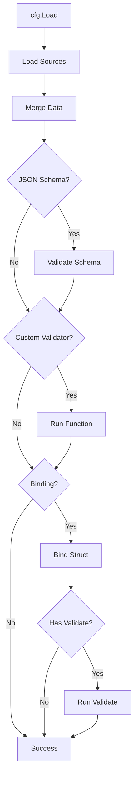

The config package supports multiple validation strategies. These help catch configuration errors early. They ensure your application runs with correct settings.

## Validation Strategies

The config package provides three validation approaches:

1. **Struct-based validation** - Implement `Validate() error` on your struct.
2. **JSON Schema validation** - Validate against a JSON Schema.
3. **Custom validation functions** - Use custom validation logic.

## Struct-Based Validation

The most idiomatic approach for Go applications. Implement the `Validate()` method on your configuration struct:

```go
type Validator interface {
    Validate() error
}
```

### Basic Example

```go
type Config struct {
    Port int    `config:"port"`
    Host string `config:"host"`
}

func (c *Config) Validate() error {
    if c.Port <= 0 || c.Port > 65535 {
        return errors.New("port must be between 1 and 65535")
    }
    if c.Host == "" {
        return errors.New("host is required")
    }
    return nil
}

var cfg Config
config := config.MustNew(
    config.WithFile("config.yaml"),
    config.WithBinding(&cfg),
)

// Validation runs automatically during Load()
if err := config.Load(context.Background()); err != nil {
    log.Fatalf("invalid configuration: %v", err)
}
```

### Complex Validation

Validate nested structures and relationships:

```go
type AppConfig struct {
    Server struct {
        Host string `config:"host"`
        Port int    `config:"port"`
        TLS  struct {
            Enabled  bool   `config:"enabled"`
            CertFile string `config:"cert_file"`
            KeyFile  string `config:"key_file"`
        } `config:"tls"`
    } `config:"server"`
    
    Database struct {
        Host        string `config:"host"`
        Port        int    `config:"port"`
        MaxConns    int    `config:"max_connections"`
        IdleConns   int    `config:"idle_connections"`
    } `config:"database"`
}

func (c *AppConfig) Validate() error {
    // Server validation
    if c.Server.Port < 1 || c.Server.Port > 65535 {
        return fmt.Errorf("server.port must be between 1-65535, got %d", c.Server.Port)
    }
    
    // TLS validation
    if c.Server.TLS.Enabled {
        if c.Server.TLS.CertFile == "" {
            return errors.New("server.tls.cert_file required when TLS enabled")
        }
        if c.Server.TLS.KeyFile == "" {
            return errors.New("server.tls.key_file required when TLS enabled")
        }
    }
    
    // Database validation
    if c.Database.Host == "" {
        return errors.New("database.host is required")
    }
    if c.Database.MaxConns < c.Database.IdleConns {
        return fmt.Errorf("database.max_connections (%d) must be >= idle_connections (%d)",
            c.Database.MaxConns, c.Database.IdleConns)
    }
    
    return nil
}
```

### Field-Level Validation

Create reusable validation helpers:

```go
func validatePort(port int) error {
    if port < 1 || port > 65535 {
        return fmt.Errorf("invalid port %d: must be between 1-65535", port)
    }
    return nil
}

func validateHostname(host string) error {
    if host == "" {
        return errors.New("hostname cannot be empty")
    }
    if len(host) > 253 {
        return errors.New("hostname too long (max 253 characters)")
    }
    return nil
}

func (c *Config) Validate() error {
    if err := validatePort(c.Server.Port); err != nil {
        return fmt.Errorf("server.port: %w", err)
    }
    if err := validateHostname(c.Server.Host); err != nil {
        return fmt.Errorf("server.host: %w", err)
    }
    return nil
}
```

## JSON Schema Validation

> **What is JSON Schema?**  
> [JSON Schema](https://json-schema.org/) is a standard for describing the structure and validation rules of JSON data. It allows you to define required fields, data types, value constraints, and more.

Validate the merged configuration map against a JSON Schema:

```go
schemaBytes, err := os.ReadFile("schema.json")
if err != nil {
    log.Fatalf("failed to read schema: %v", err)
}

cfg := config.MustNew(
    config.WithFile("config.yaml"),
    config.WithJSONSchema(schemaBytes),
)

// Schema validation runs during Load()
if err := cfg.Load(context.Background()); err != nil {
    log.Fatalf("configuration validation failed: %v", err)
}
```


JSON Schema validation is applied to the merged configuration map (`map[string]any`), not directly to Go structs. It happens before struct binding.


### Example Schema

**schema.json:**

```json
{
  "$schema": "http://json-schema.org/draft-07/schema#",
  "type": "object",
  "required": ["server", "database"],
  "properties": {
    "server": {
      "type": "object",
      "required": ["host", "port"],
      "properties": {
        "host": {
          "type": "string",
          "minLength": 1
        },
        "port": {
          "type": "integer",
          "minimum": 1,
          "maximum": 65535
        }
      }
    },
    "database": {
      "type": "object",
      "required": ["host", "port"],
      "properties": {
        "host": {
          "type": "string",
          "minLength": 1
        },
        "port": {
          "type": "integer",
          "minimum": 1,
          "maximum": 65535
        },
        "username": {
          "type": "string"
        },
        "password": {
          "type": "string"
        }
      }
    }
  }
}
```

## Custom Validation Functions

Register custom validation functions for flexible validation logic:

```go
cfg := config.MustNew(
    config.WithFile("config.yaml"),
    config.WithValidator(func(data map[string]any) error {
        // Validate the configuration map
        port, ok := data["port"].(int)
        if !ok {
            return errors.New("port must be an integer")
        }
        if port <= 0 {
            return errors.New("port must be positive")
        }
        return nil
    }),
)
```

### Multiple Validators

You can register multiple validators - all will be executed:

```go
cfg := config.MustNew(
    config.WithFile("config.yaml"),
    config.WithValidator(validatePorts),
    config.WithValidator(validateHosts),
    config.WithValidator(validateFeatures),
)

func validatePorts(data map[string]any) error {
    // Port validation logic
}

func validateHosts(data map[string]any) error {
    // Host validation logic
}

func validateFeatures(data map[string]any) error {
    // Feature flag validation logic
}
```

## Validation Workflow

The validation process follows this order:



**Validation order:**

1. Load and merge all sources
2. Run JSON Schema validation (if configured)
3. Run custom validation functions (if configured)
4. Bind to struct (if configured)
5. Run struct `Validate()` method (if implemented)

## Comparison Table

| Validation Type | For Structs | For Maps | When to Use |
|----------------|-------------|----------|-------------|
| Struct-based (`Validate() error`) | ✅ Yes | ❌ No | Type-safe validation with Go code |
| JSON Schema | ❌ No | ✅ Yes | Standard schema validation, language-agnostic |
| Custom Function | ✅ Yes | ✅ Yes | Complex logic, cross-field validation |

## Combining Validation Strategies

You can combine multiple validation approaches:

```go
type AppConfig struct {
    Server struct {
        Port int    `config:"port"`
        Host string `config:"host"`
    } `config:"server"`
}

func (c *AppConfig) Validate() error {
    if c.Server.Port <= 0 {
        return errors.New("server.port must be positive")
    }
    return nil
}

var appConfig AppConfig

schemaBytes, _ := os.ReadFile("schema.json")

cfg := config.MustNew(
    config.WithFile("config.yaml"),
    config.WithJSONSchema(schemaBytes),      // 1. Schema validation
    config.WithValidator(customValidation),  // 2. Custom validation
    config.WithBinding(&appConfig),          // 3. Struct binding + validation
)

func customValidation(data map[string]any) error {
    // Custom validation logic
    return nil
}
```

All three validations will run in sequence.

## Error Handling

Validation errors are wrapped in `ConfigError` with context:

```go
if err := cfg.Load(context.Background()); err != nil {
    // Error format examples:
    // "config error in json-schema during validate: server.port: value must be >= 1"
    // "config error in binding during validate: port must be positive"
    log.Printf("Validation failed: %v", err)
}
```

## Best Practices

### 1. Prefer Struct Validation

For Go applications, struct-based validation is most idiomatic:

```go
func (c *Config) Validate() error {
    // Clear, type-safe validation logic
}
```

### 2. Provide Helpful Error Messages

Include field names and expected values:

```go
// Bad
return errors.New("invalid value")

// Good
return fmt.Errorf("server.port must be between 1-65535, got %d", c.Server.Port)
```

### 3. Validate Relationships

Check dependencies between fields:

```go
func (c *Config) Validate() error {
    if c.TLS.Enabled && c.TLS.CertFile == "" {
        return errors.New("tls.cert_file required when tls.enabled is true")
    }
    return nil
}
```

### 4. Use JSON Schema for APIs

When exposing configuration via APIs or accepting external config:

```go
// Validate external configuration against schema
cfg := config.MustNew(
    config.WithContent(externalConfigBytes, codec.TypeJSON),
    config.WithJSONSchema(schemaBytes),
)
```

### 5. Fail Fast

Validate during initialization, not at runtime:

```go
func main() {
    cfg := loadConfig()  // Validates during Load()
    // If we reach here, config is valid
    startServer(cfg)
}
```

## Complete Example

```go
package main

import (
    "context"
    "errors"
    "fmt"
    "log"
    "os"
    "rivaas.dev/config"
)

type AppConfig struct {
    Server struct {
        Host string `config:"host"`
        Port int    `config:"port"`
        TLS  struct {
            Enabled  bool   `config:"enabled"`
            CertFile string `config:"cert_file"`
            KeyFile  string `config:"key_file"`
        } `config:"tls"`
    } `config:"server"`
    
    Database struct {
        Host     string `config:"host"`
        Port     int    `config:"port"`
        MaxConns int    `config:"max_connections"`
    } `config:"database"`
}

func (c *AppConfig) Validate() error {
    // Server validation
    if c.Server.Port < 1 || c.Server.Port > 65535 {
        return fmt.Errorf("server.port must be 1-65535, got %d", c.Server.Port)
    }
    
    // TLS validation
    if c.Server.TLS.Enabled {
        if c.Server.TLS.CertFile == "" {
            return errors.New("server.tls.cert_file required when TLS enabled")
        }
        if _, err := os.Stat(c.Server.TLS.CertFile); err != nil {
            return fmt.Errorf("server.tls.cert_file not found: %w", err)
        }
    }
    
    // Database validation
    if c.Database.Host == "" {
        return errors.New("database.host is required")
    }
    if c.Database.MaxConns <= 0 {
        return errors.New("database.max_connections must be positive")
    }
    
    return nil
}

func main() {
    var appConfig AppConfig
    
    schemaBytes, err := os.ReadFile("schema.json")
    if err != nil {
        log.Fatalf("failed to read schema: %v", err)
    }
    
    cfg := config.MustNew(
        config.WithFile("config.yaml"),
        config.WithEnv("MYAPP_"),
        config.WithJSONSchema(schemaBytes),
        config.WithBinding(&appConfig),
    )

    if err := cfg.Load(context.Background()); err != nil {
        log.Fatalf("configuration validation failed: %v", err)
    }

    log.Println("Configuration validated successfully!")
    log.Printf("Server: %s:%d", appConfig.Server.Host, appConfig.Server.Port)
}
```

## Next Steps

- Learn about [Multiple Sources](../multiple-sources/) for complex configurations
- Explore [Custom Codecs](../custom-codecs/) for custom formats
- See [Examples](../examples/) for real-world validation patterns

For technical details on error handling, see [Troubleshooting](/reference/packages/config/troubleshooting/).
