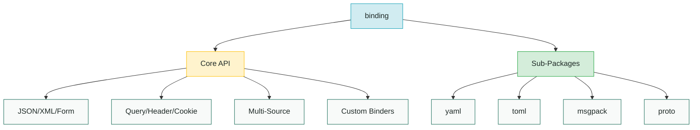

{}
This is the API reference for the `rivaas.dev/binding` package. For learning-focused documentation, see the [Binding Guide](/guides/binding/).
{}

## Package Information

- **Import Path**: `rivaas.dev/binding`
- **Go Version**: 1.25+
- **Documentation**: [pkg.go.dev/rivaas.dev/binding](https://pkg.go.dev/rivaas.dev/binding)
- **Repository**: [github.com/rivaas-dev/rivaas](https://github.com/rivaas-dev/rivaas)

## Overview

The binding package provides a high-performance, type-safe way to bind request data from various sources (query parameters, JSON bodies, headers, etc.) into Go structs using struct tags.

```go
import "rivaas.dev/binding"

type CreateUserRequest struct {
    Username string `json:"username"`
    Email    string `json:"email"`
    Age      int    `json:"age"`
}

// Generic API (preferred)
user, err := binding.JSON[CreateUserRequest](body)
```

## Key Features

- **Type-Safe Generic API**: Compile-time type safety with zero runtime overhead
- **Multiple Sources**: Query, path, form, header, cookie, JSON, XML, YAML, TOML, MessagePack, Protocol Buffers
- **Zero Allocation**: Struct reflection info cached for optimal performance
- **Flexible Type Support**: Primitives, time types, collections, nested structs, custom types
- **Detailed Errors**: Field-level error information with context
- **Extensible**: Custom type converters and value getters
- **Multi-Source Binding**: Combine data from multiple sources with precedence control

## Package Structure



## Quick Navigation

{}
{}
Core types, functions, and interfaces for request binding.

[View →](api-reference/)
{}
{}
Configuration options and binding settings.

[View →](options/)
{}
{}
YAML, TOML, MessagePack, and Protocol Buffers support.

[View →](sub-packages/)
{}
{}

{}
{}
Common issues and solutions for binding problems.

[View →](troubleshooting/)
{}
{}
Step-by-step tutorials and examples.

[View →](/guides/binding/)
{}
{}

## Core API

### Generic Functions

Type-safe binding with compile-time guarantees:

```go
// JSON binding
func JSON[T any](data []byte, opts ...Option) (T, error)

// Query parameter binding
func Query[T any](values url.Values, opts ...Option) (T, error)

// Form data binding
func Form[T any](values url.Values, opts ...Option) (T, error)

// Header binding
func Header[T any](headers http.Header, opts ...Option) (T, error)

// Cookie binding
func Cookie[T any](cookies []*http.Cookie, opts ...Option) (T, error)

// Path parameter binding
func Path[T any](params map[string]string, opts ...Option) (T, error)

// XML binding
func XML[T any](data []byte, opts ...Option) (T, error)

// Multi-source binding
func Bind[T any](sources ...Source) (T, error)
```

### Non-Generic Functions

For cases where type comes from a variable:

```go
// JSON binding to pointer
func JSONTo(data []byte, target interface{}, opts ...Option) error

// Query binding to pointer
func QueryTo(values url.Values, target interface{}, opts ...Option) error

// ... similar for other sources
```

### Reader Variants

Stream from `io.Reader` for large payloads:

```go
func JSONReader[T any](r io.Reader, opts ...Option) (T, error)
func XMLReader[T any](r io.Reader, opts ...Option) (T, error)
```

## Type System

### Built-in Type Support

| Category | Types |
|----------|-------|
| **Primitives** | `string`, `int`, `int8`, `int16`, `int32`, `int64`, `uint`, `uint8`, `uint16`, `uint32`, `uint64`, `float32`, `float64`, `bool` |
| **Time** | `time.Time`, `time.Duration` |
| **Network** | `net.IP`, `net.IPNet`, `url.URL` |
| **Regex** | `regexp.Regexp` |
| **Collections** | `[]T`, `map[string]T` |
| **Pointers** | `*T` for any supported type |
| **Nested** | Nested structs with dot notation |

### Custom Types

Register custom converters for unsupported types:

```go
import "github.com/google/uuid"

binder := binding.MustNew(
    binding.WithConverter[uuid.UUID](uuid.Parse),
)
```

## Struct Tags

Control binding behavior with struct tags:

| Tag | Purpose | Example |
|-----|---------|---------|
| `json` | JSON body field | `json:"field_name"` |
| `query` | Query parameter | `query:"param_name"` |
| `form` | Form data | `form:"field_name"` |
| `header` | HTTP header | `header:"X-Header-Name"` |
| `path` | Path parameter | `path:"param_name"` |
| `cookie` | HTTP cookie | `cookie:"cookie_name"` |
| `default` | Default value | `default:"value"` |
| `validate` | Validation rules | `validate:"required,email"` |

## Error Types

### BindError

Field-specific binding error:

```go
type BindError struct {
    Field  string // Field name
    Source string // Source ("query", "json", etc.)
    Value  string // Raw value
    Type   string // Expected type
    Reason string // Error reason
    Err    error  // Underlying error
}
```

### UnknownFieldError

Unknown fields in strict mode:

```go
type UnknownFieldError struct {
    Fields []string // List of unknown fields
}
```

### MultiError

Multiple errors with `WithAllErrors()`:

```go
type MultiError struct {
    Errors []*BindError
}
```

## Configuration Options

Common options for all binding functions:

```go
// Security limits
binding.WithMaxDepth(16)        // Max struct nesting
binding.WithMaxSliceLen(1000)   // Max slice elements
binding.WithMaxMapSize(500)     // Max map entries

// Unknown fields
binding.WithStrictJSON()         // Fail on unknown fields
binding.WithUnknownFields(mode)  // UnknownError/UnknownWarn/UnknownIgnore

// Slice parsing
binding.WithSliceMode(mode)      // SliceRepeat or SliceCSV

// Error collection
binding.WithAllErrors()          // Collect all errors instead of failing on first
```

## Reusable Binders

Create configured binder instances:

```go
binder := binding.MustNew(
    binding.WithConverter[uuid.UUID](uuid.Parse),
    binding.WithTimeLayouts("2006-01-02", "01/02/2006"),
    binding.WithMaxDepth(16),
)

// Use across handlers
user, err := binder.JSON[User](body)
params, err := binder.Query[Params](values)
```

## Sub-Packages

Additional format support via sub-packages:

| Package | Format | Import Path |
|---------|--------|-------------|
| `yaml` | YAML | `rivaas.dev/binding/yaml` |
| `toml` | TOML | `rivaas.dev/binding/toml` |
| `msgpack` | MessagePack | `rivaas.dev/binding/msgpack` |
| `proto` | Protocol Buffers | `rivaas.dev/binding/proto` |

## Performance Characteristics

- **First binding**: ~500ns overhead for reflection
- **Subsequent bindings**: ~50ns overhead (cache lookup)
- **Query/Path/Form**: Zero allocations for primitive types
- **JSON/XML**: Allocations depend on `encoding/json` and `encoding/xml`
- **Thread-safe**: All operations are safe for concurrent use

## Integration

### With net/http

```go
func Handler(w http.ResponseWriter, r *http.Request) {
    req, err := binding.JSON[CreateUserRequest](r.Body)
    if err != nil {
        http.Error(w, err.Error(), http.StatusBadRequest)
        return
    }
    // Process request...
}
```

### With rivaas.dev/router

```go
import "rivaas.dev/router"

func Handler(c *router.Context) error {
    req, err := binding.JSON[CreateUserRequest](c.Request().Body)
    if err != nil {
        return c.JSON(http.StatusBadRequest, err)
    }
    return c.JSON(http.StatusOK, processRequest(req))
}
```

### With rivaas.dev/app

```go
import "rivaas.dev/app"

func Handler(c *app.Context) error {
    var req CreateUserRequest
    if err := c.Bind(&req); err != nil {
        return err  // Automatically handled
    }
    return c.JSON(http.StatusOK, processRequest(req))
}
```

## Version Compatibility

The binding package follows semantic versioning:

- **v1.x**: Stable API, backward compatible
- **v2.x**: Major changes, may require code updates

## External Links

- [pkg.go.dev Documentation](https://pkg.go.dev/rivaas.dev/binding)
- [GitHub Repository](https://github.com/rivaas-dev/rivaas/tree/main/binding)
- [Issue Tracker](https://github.com/rivaas-dev/rivaas/issues)
- [Contributing Guide](https://github.com/rivaas-dev/rivaas/blob/main/CONTRIBUTING.md)

## See Also

- **[rivaas.dev/validation](../validation/)** - Request validation
- **[rivaas.dev/router](../router/)** - HTTP routing
- **[rivaas.dev/app](../app/)** - Application framework

---

For step-by-step guides and tutorials, see the [Binding Guide](/guides/binding/).

For real-world examples, see the [Examples](/guides/binding/examples/) page.
