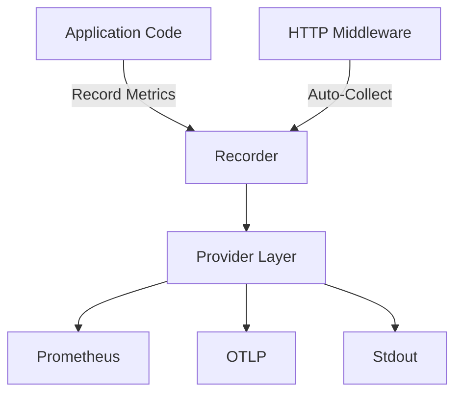

{}
This is the API reference for the `rivaas.dev/metrics` package. For learning-focused documentation, see the [Metrics Guide](/guides/metrics/).
{}

## Package Information

- **Import Path:** `rivaas.dev/metrics`
- **Go Version:** 1.25+
- **Documentation:** [pkg.go.dev/rivaas.dev/metrics](https://pkg.go.dev/rivaas.dev/metrics)
- **Source Code:** [GitHub](https://github.com/rivaas-dev/rivaas/tree/main/metrics)

## Package Overview

The metrics package provides OpenTelemetry-based metrics collection for Go applications with support for multiple exporters including Prometheus, OTLP, and stdout.

### Core Features

- Multiple metrics providers (Prometheus, OTLP, stdout)
- Built-in HTTP metrics via middleware
- Custom metrics (counters, histograms, gauges)
- Thread-safe operations
- Context-aware methods
- Automatic header filtering for security
- Testing utilities

## Architecture

The package is built on OpenTelemetry and provides a simplified interface for common metrics use cases.



### Components

#### Main Package (`rivaas.dev/metrics`)

Core metrics collection including:
- `Recorder` - Main metrics recorder
- `New()` / `MustNew()` - Recorder initialization
- Custom metrics methods - Counters, histograms, gauges
- `Middleware()` - HTTP metrics collection
- Testing utilities

## Quick API Index

### Recorder Creation

```go
recorder, err := metrics.New(options...)     // With error handling
recorder := metrics.MustNew(options...)      // Panics on error
```

### Lifecycle Management

```go
err := recorder.Start(ctx context.Context)   // Start metrics server/exporter
err := recorder.Shutdown(ctx context.Context) // Graceful shutdown
err := recorder.ForceFlush(ctx context.Context) // Force immediate export
```

### Recording Metrics

```go
// Counters
err := recorder.IncrementCounter(ctx, name, attributes...)
err := recorder.AddCounter(ctx, name, value, attributes...)

// Histograms
err := recorder.RecordHistogram(ctx, name, value, attributes...)

// Gauges
err := recorder.SetGauge(ctx, name, value, attributes...)
```

### HTTP Middleware

```go
handler := metrics.Middleware(recorder, options...)(httpHandler)
```

### Provider-Specific Methods

```go
address := recorder.ServerAddress()          // Prometheus: actual address
handler, err := recorder.Handler()           // Prometheus: metrics handler
count := recorder.CustomMetricCount()        // Number of custom metrics
```

### Testing Utilities

```go
recorder := metrics.TestingRecorder(t, serviceName)
recorder := metrics.TestingRecorderWithPrometheus(t, serviceName)
err := metrics.WaitForMetricsServer(t, address, timeout)
```

## Reference Pages

{}
{}
Recorder type, lifecycle methods, and custom metrics API.

[View →](api-reference/)
{}
{}
Configuration options for providers and service metadata.

[View →](options/)
{}
{}
HTTP middleware configuration and path exclusion.

[View →](middleware-options/)
{}
{}

{}
{}
Common metrics issues and solutions.

[View →](troubleshooting/)
{}
{}
Step-by-step tutorials and examples.

[View →](/guides/metrics/)
{}
{}

## Type Reference

### Recorder

```go
type Recorder struct {
    // contains filtered or unexported fields
}
```

Main metrics recorder. Thread-safe for concurrent access.

**Methods**: See [API Reference](api-reference/) for complete method documentation.

### Option

```go
type Option func(*Recorder)
```

Configuration option function type used with `New()` and `MustNew()`.

**Available Options**: See [Options](options/) for all options.

### EventType

```go
type EventType int

const (
    EventError   EventType = iota // Error events
    EventWarning                   // Warning events
    EventInfo                      // Informational events
    EventDebug                     // Debug events
)
```

Event severity levels for internal operational events.

### Event

```go
type Event struct {
    Type    EventType
    Message string
    Args    []any // slog-style key-value pairs
}
```

Internal operational event from the metrics package.

### EventHandler

```go
type EventHandler func(Event)
```

Processes internal operational events. Used with `WithEventHandler` option.

## Common Patterns

### Basic Usage

```go
recorder := metrics.MustNew(
    metrics.WithPrometheus(":9090", "/metrics"),
    metrics.WithServiceName("my-api"),
)
recorder.Start(context.Background())
defer recorder.Shutdown(context.Background())

_ = recorder.IncrementCounter(ctx, "requests_total")
```

### With HTTP Middleware

```go
recorder := metrics.MustNew(
    metrics.WithPrometheus(":9090", "/metrics"),
    metrics.WithServiceName("my-api"),
)
recorder.Start(context.Background())

handler := metrics.Middleware(recorder,
    metrics.WithExcludePaths("/health"),
)(httpHandler)

http.ListenAndServe(":8080", handler)
```

### With OTLP

```go
recorder := metrics.MustNew(
    metrics.WithOTLP("http://localhost:4318"),
    metrics.WithServiceName("my-service"),
)
recorder.Start(ctx) // Required before recording metrics
defer recorder.Shutdown(context.Background())
```

## Thread Safety

The `Recorder` type is thread-safe for:
- All metric recording methods
- Concurrent `Start()` and `Shutdown()` operations
- Mixed recording and lifecycle operations

Not thread-safe for:
- Concurrent modification during initialization

## Performance Notes

- **Metric recording**: ~1-2 microseconds per operation
- **HTTP middleware**: ~1-2 microseconds overhead per request
- **Memory usage**: Scales with number of unique metric names and label combinations
- **Histogram overhead**: Proportional to bucket count

**Best Practices**:
- Use fire-and-forget pattern for most metrics (ignore errors)
- Limit metric cardinality (avoid high-cardinality labels)
- Customize histogram buckets for your use case
- Exclude high-traffic paths from middleware when appropriate

## Built-in Metrics

When using HTTP middleware, these metrics are automatically collected:

| Metric | Type | Description |
|--------|------|-------------|
| `http_request_duration_seconds` | Histogram | Request duration distribution |
| `http_requests_total` | Counter | Total requests by method, path, status |
| `http_requests_active` | Gauge | Currently active requests |
| `http_request_size_bytes` | Histogram | Request body size distribution |
| `http_response_size_bytes` | Histogram | Response body size distribution |
| `http_errors_total` | Counter | HTTP errors by status code |
| `custom_metric_failures_total` | Counter | Failed custom metric creations |

## Version Compatibility

The metrics package follows semantic versioning. The API is stable for the v1 series.

**Minimum Go version:** 1.25

**OpenTelemetry compatibility:** Uses OpenTelemetry SDK v1.x

## Next Steps

- Read the [API Reference](api-reference/) for detailed method documentation
- Explore [Options](options/) for all available configuration options
- Check [Middleware Options](middleware-options/) for HTTP integration
- Review [Troubleshooting](troubleshooting/) for common issues

For learning-focused guides, see the [Metrics Guide](/guides/metrics/).
