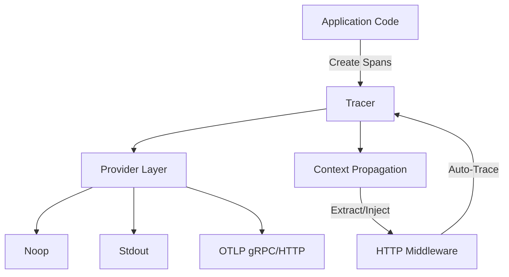

Complete API reference for the `rivaas.dev/tracing` package.

## Package Information

- **Import Path:** `rivaas.dev/tracing`
- **Go Version:** 1.25+
- **Documentation:** [pkg.go.dev/rivaas.dev/tracing](https://pkg.go.dev/rivaas.dev/tracing)
- **Source Code:** [GitHub](https://github.com/rivaas-dev/rivaas/tree/main/tracing)

## Package Overview

The tracing package provides OpenTelemetry-based distributed tracing for Go applications with support for multiple exporters including Stdout, OTLP (gRPC and HTTP), and Noop.

### Core Features

- Multiple tracing providers (Stdout, OTLP, Noop)
- Built-in HTTP middleware for request tracing
- Manual span management with attributes and events
- Context propagation for distributed tracing
- Thread-safe operations
- Span lifecycle hooks
- Testing utilities

## Architecture

The package is built on OpenTelemetry and provides a simplified interface for distributed tracing.



### Components

#### Main Package (`rivaas.dev/tracing`)

Core tracing functionality including:
- `Tracer` - Main tracer for creating and managing spans
- `New()` / `MustNew()` - Tracer initialization
- Span management - Create, finish, add attributes/events
- `Middleware()` - HTTP request tracing
- `ContextTracing` - Helper for router context integration
- Context helpers - Extract, inject, get trace IDs
- Testing utilities

## Quick API Index

### Tracer Creation

```go
tracer, err := tracing.New(options...)     // With error handling
tracer := tracing.MustNew(options...)      // Panics on error
```

### Lifecycle Management

```go
err := tracer.Start(ctx context.Context)   // Start OTLP providers
err := tracer.Shutdown(ctx context.Context) // Graceful shutdown
```

### Span Management

```go
// Create spans
ctx, span := tracer.StartSpan(ctx, "operation-name")
tracer.FinishSpan(span, statusCode)

// Add attributes
tracer.SetSpanAttribute(span, "key", value)

// Add events
tracer.AddSpanEvent(span, "event-name", attrs...)
```

### Context Propagation

```go
// Extract from incoming requests
ctx := tracer.ExtractTraceContext(ctx, req.Header)

// Inject into outgoing requests
tracer.InjectTraceContext(ctx, req.Header)
```

### HTTP Middleware

```go
handler := tracing.Middleware(tracer, options...)(httpHandler)
handler := tracing.MustMiddleware(tracer, options...)(httpHandler)
```

### Context Helpers

```go
traceID := tracing.TraceID(ctx)
spanID := tracing.SpanID(ctx)
tracing.SetSpanAttributeFromContext(ctx, "key", value)
tracing.AddSpanEventFromContext(ctx, "event-name", attrs...)
```

### Testing Utilities

```go
tracer := tracing.TestingTracer(t, options...)
tracer := tracing.TestingTracerWithStdout(t, options...)
middleware := tracing.TestingMiddleware(t, middlewareOptions...)
```

### ContextTracing Helper

```go
ct := tracing.NewContextTracing(ctx, tracer, span)
ct.SetSpanAttribute("key", value)
ct.AddSpanEvent("event-name", attrs...)
traceID := ct.TraceID()
```

## Reference Pages

### [API Reference](api-reference/)

Complete documentation of the Tracer type and all methods including:
- Tracer lifecycle methods
- Span management methods
- Context propagation methods
- ContextTracing helper type
- Event types and handlers
- Error handling

### [Options](options/)

Comprehensive list of all configuration options:
- Provider options (`WithOTLP`, `WithStdout`, `WithNoop`)
- Service options (`WithServiceName`, `WithServiceVersion`)
- Sampling options (`WithSampleRate`)
- Hook options (`WithSpanStartHook`, `WithSpanFinishHook`)
- Advanced options (propagators, custom providers, logging)

### [Middleware Options](middleware-options/)

HTTP middleware configuration options:
- Path exclusion options
- Header recording options
- Parameter recording options
- Security considerations

### [Troubleshooting](troubleshooting/)

Common issues and solutions:
- Traces not appearing
- Context propagation issues
- Performance considerations
- Provider configuration problems

## Type Reference

### Tracer

```go
type Tracer struct {
    // contains filtered or unexported fields
}
```

Main tracer for distributed tracing. Thread-safe for concurrent access.

**Methods**: See [API Reference](api-reference/) for complete method documentation.

### Option

```go
type Option func(*Tracer)
```

Configuration option function type used with `New()` and `MustNew()`.

**Available Options**: See [Options](options/) for all options.

### MiddlewareOption

```go
type MiddlewareOption func(*middlewareConfig)
```

HTTP middleware configuration option.

**Available Options**: See [Middleware Options](middleware-options/) for all options.

### Provider

```go
type Provider string

const (
    NoopProvider     Provider = "noop"
    StdoutProvider   Provider = "stdout"
    OTLPProvider     Provider = "otlp"
    OTLPHTTPProvider Provider = "otlp-http"
)
```

Available tracing providers.

### EventType

```go
type EventType int

const (
    EventError   EventType = iota // Error events
    EventWarning                   // Warning events
    EventInfo                      // Informational events
    EventDebug                     // Debug events
)
```

Event severity levels for internal operational events.

### Event

```go
type Event struct {
    Type    EventType
    Message string
    Args    []any // slog-style key-value pairs
}
```

Internal operational event from the tracing package.

### EventHandler

```go
type EventHandler func(Event)
```

Processes internal operational events. Used with `WithEventHandler` option.

### SpanStartHook

```go
type SpanStartHook func(ctx context.Context, span trace.Span, req *http.Request)
```

Callback invoked when a request span is started.

### SpanFinishHook

```go
type SpanFinishHook func(span trace.Span, statusCode int)
```

Callback invoked when a request span is finished.

## Common Patterns

### Basic Usage

```go
tracer := tracing.MustNew(
    tracing.WithServiceName("my-api"),
    tracing.WithOTLP("localhost:4317"),
)
tracer.Start(context.Background())
defer tracer.Shutdown(context.Background())

ctx, span := tracer.StartSpan(ctx, "operation")
defer tracer.FinishSpan(span, http.StatusOK)
```

### With HTTP Middleware

```go
tracer := tracing.MustNew(
    tracing.WithServiceName("my-api"),
    tracing.WithOTLP("localhost:4317"),
)
tracer.Start(context.Background())

handler := tracing.MustMiddleware(tracer,
    tracing.WithExcludePaths("/health"),
)(httpHandler)

http.ListenAndServe(":8080", handler)
```

### Distributed Tracing

```go
// Service A - inject trace context
req, _ := http.NewRequestWithContext(ctx, "GET", url, nil)
tracer.InjectTraceContext(ctx, req.Header)
resp, _ := http.DefaultClient.Do(req)

// Service B - extract trace context
ctx = tracer.ExtractTraceContext(r.Context(), r.Header)
ctx, span := tracer.StartSpan(ctx, "operation")
defer tracer.FinishSpan(span, http.StatusOK)
```

## Thread Safety

The `Tracer` type is thread-safe for:
- All span management methods
- Concurrent `Start()` and `Shutdown()` operations
- Mixed tracing and lifecycle operations
- Context propagation methods

Not thread-safe for:
- Concurrent modification during initialization

## Performance Notes

- **Request overhead (100% sampling)**: ~1.6 microseconds
- **Start/Finish span**: ~160 nanoseconds
- **Set attribute**: ~3 nanoseconds
- **Path exclusion (100 paths)**: ~9 nanoseconds

**Best Practices**:
- Use sampling for high-traffic endpoints
- Exclude health checks and metrics endpoints
- Limit span attribute cardinality
- Use path prefixes instead of regex when possible

## Comparison with Metrics Package

The tracing package follows the same design pattern as the metrics package:

| Aspect | Metrics Package | Tracing Package |
|--------|----------------|-----------------|
| Main Type | `Recorder` | `Tracer` |
| Provider Options | `WithPrometheus()`, `WithOTLP()` | `WithOTLP()`, `WithStdout()`, `WithNoop()` |
| Constructor | `New(opts...) (*Recorder, error)` | `New(opts...) (*Tracer, error)` |
| Panic Version | `MustNew(opts...) *Recorder` | `MustNew(opts...) *Tracer` |
| Middleware | `Middleware(recorder, opts...)` | `Middleware(tracer, opts...)` |
| Panic Middleware | `MustMiddleware(recorder, opts...)` | `MustMiddleware(tracer, opts...)` |
| Path Exclusion | `MiddlewareOption` | `MiddlewareOption` |
| Header Recording | `MiddlewareOption` | `MiddlewareOption` |

## Version Compatibility

The tracing package follows semantic versioning. The API is stable for the v1 series.

**Minimum Go version:** 1.25

**OpenTelemetry compatibility:** Uses OpenTelemetry SDK v1.x

## Next Steps

- Read the [API Reference](api-reference/) for detailed method documentation
- Explore [Options](options/) for all available configuration options
- Check [Middleware Options](middleware-options/) for HTTP integration
- Review [Troubleshooting](troubleshooting/) for common issues

For learning-focused guides, see the [Tracing Guide](/guides/tracing/).
