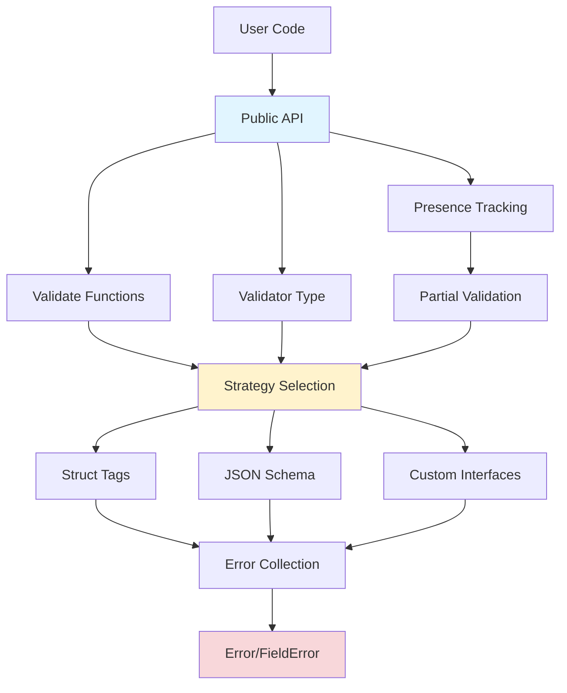

{}
This is the API reference for the `rivaas.dev/validation` package. For learning-focused documentation, see the [Validation Guide](/guides/validation/).
{}

## Package Information

- **Import Path**: `rivaas.dev/validation`
- **Go Version**: 1.25+
- **Documentation**: [pkg.go.dev/rivaas.dev/validation](https://pkg.go.dev/rivaas.dev/validation)
- **Repository**: [github.com/rivaas-dev/rivaas](https://github.com/rivaas-dev/rivaas)

## Overview

The validation package provides flexible validation for Go structs with support for multiple strategies: struct tags, JSON Schema, and custom interfaces. It's designed for web applications with features like partial validation for PATCH requests, sensitive data redaction, and detailed error reporting.

```go
import "rivaas.dev/validation"

type User struct {
    Email string `validate:"required,email"`
    Age   int    `validate:"min=18"`
}

err := validation.Validate(ctx, &user)
```

## Key Features

- **Multiple Validation Strategies**: Struct tags, JSON Schema, custom interfaces
- **Partial Validation**: PATCH request support with presence tracking
- **Thread-Safe**: Safe for concurrent use
- **Security**: Built-in redaction, nesting limits, memory protection
- **Structured Errors**: Field-level errors with codes and metadata
- **Extensible**: Custom tags, validators, and error messages

## Package Architecture



## Quick Navigation



Core types, functions, and validation methods.

[View →](api-reference/)


Configuration options and validator settings.

[View →](options/)


Custom validation interfaces and providers.

[View →](interfaces/)





Validation strategy selection and priority.

[View →](strategies/)


Common validation issues and solutions.

[View →](troubleshooting/)


Step-by-step tutorials and examples.

[View →](/guides/validation/)



## Core API

### Package-Level Functions

Simple validation without creating a validator instance:

```go
// Validate with default configuration
func Validate(ctx context.Context, v any, opts ...Option) error

// Validate only present fields (PATCH requests)
func ValidatePartial(ctx context.Context, v any, pm PresenceMap, opts ...Option) error

// Compute which fields are present in JSON
func ComputePresence(rawJSON []byte) (PresenceMap, error)
```

### Validator Type

Create configured validator instances for reuse:

```go
// Create validator (returns error on invalid config)
func New(opts ...Option) (*Validator, error)

// Create validator (panics on invalid config)
func MustNew(opts ...Option) *Validator

// Validator methods
func (v *Validator) Validate(ctx context.Context, val any, opts ...Option) error
func (v *Validator) ValidatePartial(ctx context.Context, val any, pm PresenceMap, opts ...Option) error
```

### Error Types

Structured validation errors:

```go
// Main error type with multiple field errors
type Error struct {
    Fields    []FieldError
    Truncated bool
}

// Individual field error
type FieldError struct {
    Path    string         // JSON path (e.g., "items.2.price")
    Code    string         // Error code (e.g., "tag.required")
    Message string         // Human-readable message
    Meta    map[string]any // Additional metadata
}
```

### Interfaces

Implement these for custom validation:

```go
// Simple custom validation
type ValidatorInterface interface {
    Validate() error
}

// Context-aware custom validation
type ValidatorWithContext interface {
    ValidateContext(context.Context) error
}

// JSON Schema provider
type JSONSchemaProvider interface {
    JSONSchema() (id, schema string)
}

// Redactor for sensitive fields
type Redactor func(path string) bool
```

## Validation Strategies

The package supports three strategies with automatic selection:

**Priority Order:**
1. Interface methods (`Validate()` / `ValidateContext()`)
2. Struct tags (`validate:"..."`)
3. JSON Schema (`JSONSchemaProvider`)

```go
// Automatic strategy selection
err := validation.Validate(ctx, &user)

// Explicit strategy
err := validation.Validate(ctx, &user,
    validation.WithStrategy(validation.StrategyTags),
)

// Run all strategies
err := validation.Validate(ctx, &user,
    validation.WithRunAll(true),
)
```

## Configuration Options

### Validator Creation Options

```go
validator := validation.MustNew(
    validation.WithMaxErrors(10),              // Limit errors returned
    validation.WithMaxCachedSchemas(2048),     // Schema cache size
    validation.WithRedactor(redactorFunc),     // Redact sensitive fields
    validation.WithCustomTag("phone", phoneValidator), // Custom tag
    validation.WithMessages(messageMap),       // Custom error messages
    validation.WithMessageFunc("min", minFunc), // Dynamic messages
)
```

### Per-Call Options

```go
err := validator.Validate(ctx, &user,
    validation.WithStrategy(validation.StrategyTags),
    validation.WithPartial(true),
    validation.WithPresence(presenceMap),
    validation.WithMaxErrors(5),
    validation.WithCustomValidator(customFunc),
)
```

## Usage Patterns

### Basic Validation

```go
type User struct {
    Email string `validate:"required,email"`
    Age   int    `validate:"min=18"`
}

user := User{Email: "test@example.com", Age: 25}
if err := validation.Validate(ctx, &user); err != nil {
    var verr *validation.Error
    if errors.As(err, &verr) {
        for _, fieldErr := range verr.Fields {
            fmt.Printf("%s: %s\n", fieldErr.Path, fieldErr.Message)
        }
    }
}
```

### Partial Validation (PATCH)

```go
rawJSON := []byte(`{"email": "new@example.com"}`)

presence, _ := validation.ComputePresence(rawJSON)
var req UpdateUserRequest
json.Unmarshal(rawJSON, &req)

err := validation.ValidatePartial(ctx, &req, presence)
```

### Custom Validator

```go
validator := validation.MustNew(
    validation.WithCustomTag("phone", func(fl validator.FieldLevel) bool {
        return phoneRegex.MatchString(fl.Field().String())
    }),
    validation.WithRedactor(func(path string) bool {
        return strings.Contains(path, "password")
    }),
)

err := validator.Validate(ctx, &user)
```

## Performance Characteristics

- **First validation**: ~500ns overhead for reflection
- **Subsequent validations**: ~50ns overhead (cache lookup)
- **Schema caching**: LRU with configurable size (default 1024)
- **Thread-safe**: All operations safe for concurrent use
- **Zero allocation**: Field paths cached per type

## Integration

### With net/http

```go
func Handler(w http.ResponseWriter, r *http.Request) {
    var req CreateUserRequest
    json.NewDecoder(r.Body).Decode(&req)
    
    if err := validation.Validate(r.Context(), &req); err != nil {
        http.Error(w, err.Error(), http.StatusUnprocessableEntity)
        return
    }
    // Process request
}
```

### With rivaas.dev/router

```go
func Handler(c *router.Context) error {
    var req CreateUserRequest
    c.BindJSON(&req)
    
    if err := validation.Validate(c.Request().Context(), &req); err != nil {
        return c.JSON(http.StatusUnprocessableEntity, err)
    }
    return c.JSON(http.StatusOK, processRequest(req))
}
```

### With rivaas.dev/app

```go
func Handler(c *app.Context) error {
    var req CreateUserRequest
    if err := c.Bind(&req); err != nil {
        return err // Automatically validated and handled
    }
    return c.JSON(http.StatusOK, processRequest(req))
}
```

## Version Compatibility

The validation package follows semantic versioning:

- **v1.x**: Stable API, backward compatible
- **v2.x**: Major changes, may require code updates

## External Links

- [pkg.go.dev Documentation](https://pkg.go.dev/rivaas.dev/validation)
- [GitHub Repository](https://github.com/rivaas-dev/rivaas/tree/main/validation)
- [Issue Tracker](https://github.com/rivaas-dev/rivaas/issues)
- [Contributing Guide](https://github.com/rivaas-dev/rivaas/blob/main/CONTRIBUTING.md)

## See Also

- **[rivaas.dev/binding](../binding/)** - Request data binding
- **[rivaas.dev/router](../router/)** - HTTP routing
- **[rivaas.dev/app](../app/)** - Application framework
- **[go-playground/validator](https://pkg.go.dev/github.com/go-playground/validator/v10)** - Underlying struct tag validator

---

For step-by-step guides and tutorials, see the [Validation Guide](/guides/validation/).

For real-world examples, see the [Examples](/guides/validation/examples/) page.
