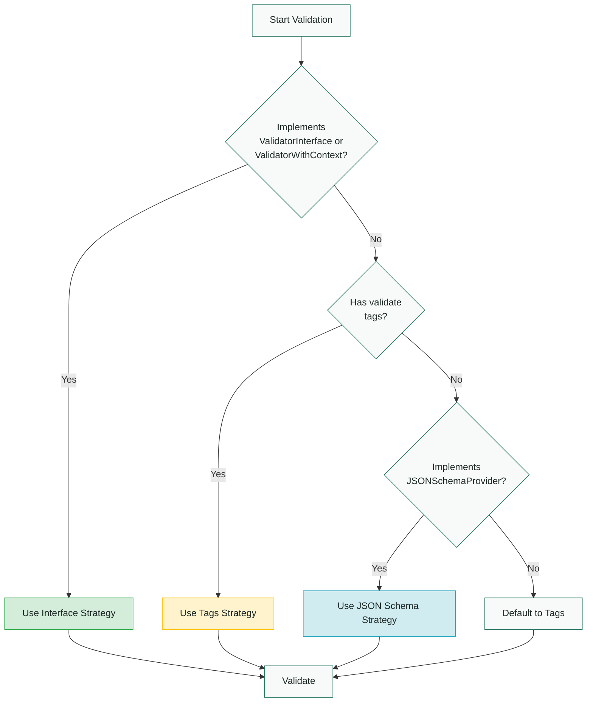

Complete reference for validation strategies, automatic selection, and priority order.

## Overview

The validation package supports three validation strategies that can be used individually or combined:

1. **Interface Methods** - `Validate()` / `ValidateContext()`
2. **Struct Tags** - `validate:"..."` tags
3. **JSON Schema** - `JSONSchemaProvider` interface

## Strategy Types

### StrategyAuto

```go
const StrategyAuto Strategy = iota
```

Automatically selects the best strategy based on the type (default behavior).

**Priority Order:**
1. Interface methods (highest priority)
2. Struct tags
3. JSON Schema (lowest priority)

**Example:**

```go
// Uses automatic strategy selection
err := validation.Validate(ctx, &user)
```

### StrategyTags

```go
const StrategyTags Strategy = ...
```

Uses struct tag validation with go-playground/validator.

**Requirements:**
- Struct type
- Fields with `validate` tags

**Example:**

```go
type User struct {
    Email string `validate:"required,email"`
}

err := validation.Validate(ctx, &user,
    validation.WithStrategy(validation.StrategyTags),
)
```

### StrategyJSONSchema

```go
const StrategyJSONSchema Strategy = ...
```

Uses JSON Schema validation (RFC-compliant).

**Requirements:**
- Type implements `JSONSchemaProvider` interface, OR
- Custom schema provided with `WithCustomSchema`

**Example:**

```go
func (u User) JSONSchema() (id, schema string) {
    return "user-v1", `{...}`
}

err := validation.Validate(ctx, &user,
    validation.WithStrategy(validation.StrategyJSONSchema),
)
```

### StrategyInterface

```go
const StrategyInterface Strategy = ...
```

Uses custom interface methods (`Validate()` or `ValidateContext()`).

**Requirements:**
- Type implements `ValidatorInterface` or `ValidatorWithContext`

**Example:**

```go
func (u *User) Validate() error {
    return customValidation(u)
}

err := validation.Validate(ctx, &user,
    validation.WithStrategy(validation.StrategyInterface),
)
```

## Automatic Strategy Selection

### Selection Process

When `StrategyAuto` is used (default), the validator checks strategies in priority order:



### Applicability Checks

A strategy is considered "applicable" if:

**Interface Strategy:**
- Type implements `ValidatorInterface` or `ValidatorWithContext`
- Checks both value and pointer receivers

**Tags Strategy:**
- Type is a struct
- At least one field has a `validate` tag

**JSON Schema Strategy:**
- Type implements `JSONSchemaProvider`, OR
- Custom schema provided with `WithCustomSchema`

### Priority Examples

```go
// Example 1: Only interface method
type User struct {
    Email string
}

func (u *User) Validate() error {
    return validateEmail(u.Email)
}

// Uses: StrategyInterface (highest priority)
validation.Validate(ctx, &user)
```

```go
// Example 2: Both interface and tags
type User struct {
    Email string `validate:"required,email"`
}

func (u *User) Validate() error {
    return customLogic(u.Email)
}

// Uses: StrategyInterface (interface has priority over tags)
validation.Validate(ctx, &user)
```

```go
// Example 3: All three strategies
type User struct {
    Email string `validate:"required,email"`
}

func (u User) JSONSchema() (id, schema string) {
    return "user-v1", `{...}`
}

func (u *User) Validate() error {
    return customLogic(u.Email)
}

// Uses: StrategyInterface (highest priority)
validation.Validate(ctx, &user)
```

## Explicit Strategy Selection

Override automatic selection with `WithStrategy`:

```go
type User struct {
    Email string `validate:"required,email"` // Has tags
}

func (u *User) Validate() error {
    return customLogic(u.Email) // Has interface method
}

// Force use of tags (skip interface method)
err := validation.Validate(ctx, &user,
    validation.WithStrategy(validation.StrategyTags),
)
```

## Running Multiple Strategies

### WithRunAll

Run all applicable strategies and aggregate errors:

```go
type User struct {
    Email string `validate:"required,email"` // Tags
}

func (u User) JSONSchema() (id, schema string) {
    return "user-v1", `{...}` // JSON Schema
}

func (u *User) Validate() error {
    return customLogic(u.Email) // Interface
}

// Run all three strategies
err := validation.Validate(ctx, &user,
    validation.WithRunAll(true),
)

// All errors from all strategies are collected
var verr *validation.Error
if errors.As(err, &verr) {
    // verr.Fields contains errors from all strategies
}
```

### WithRequireAny

With `WithRunAll`, succeed if any one strategy passes (OR logic):

```go
// Pass if ANY strategy succeeds
err := validation.Validate(ctx, &user,
    validation.WithRunAll(true),
    validation.WithRequireAny(true),
)
```

**Use Cases:**
- Multiple validation approaches, any one is sufficient
- Fallback validation strategies
- Gradual migration between strategies

## Strategy Comparison

| Strategy | Advantages | Disadvantages | Best For |
|----------|-----------|---------------|----------|
| **Interface** | Most flexible, full programmatic control | More code, not declarative | Complex business logic, database checks |
| **Tags** | Concise, declarative, well-documented | Limited to supported tags | Standard validation, simple rules |
| **JSON Schema** | Portable, language-independent | Verbose, learning curve | Shared validation with frontend |

## Strategy Patterns

### Pattern 1: Tags for Simple, Interface for Complex

```go
type User struct {
    Email    string `validate:"required,email"`
    Username string `validate:"required,min=3,max=20"`
    Age      int    `validate:"required,min=18"`
}

func (u *User) ValidateContext(ctx context.Context) error {
    // Complex validation (database checks, etc.)
    db := ctx.Value("db").(*sql.DB)
    return checkUsernameUnique(ctx, db, u.Username)
}

// Tags validate format, interface validates business rules
validation.Validate(ctx, &user)
```

### Pattern 2: Schema for API, Interface for Internal

```go
func (u User) JSONSchema() (id, schema string) {
    // For external API documentation/validation
    return "user-v1", apiSchema
}

func (u *User) ValidateContext(ctx context.Context) error {
    // Internal business rules
    return validateInternal(ctx, u)
}

// External API: use schema
validation.Validate(ctx, &user,
    validation.WithStrategy(validation.StrategyJSONSchema),
)

// Internal: use interface
validation.Validate(ctx, &user,
    validation.WithStrategy(validation.StrategyInterface),
)
```

### Pattern 3: Progressive Enhancement

```go
// Start with tags
type User struct {
    Email string `validate:"required,email"`
}

// Add interface for complex validation later
func (u *User) ValidateContext(ctx context.Context) error {
    // Complex validation added over time
    return additionalValidation(ctx, u)
}

// Automatically uses interface (higher priority)
validation.Validate(ctx, &user)
```

## Performance Considerations

### Strategy Performance

**Fastest to Slowest:**
1. **Tags** - Cached reflection, zero allocation after first use
2. **Interface** - Direct method call, user code performance
3. **JSON Schema** - Schema compilation (cached), RFC validation

### Optimization Tips

```go
// Fast: Use tags for simple validation
type User struct {
    Email string `validate:"required,email"`
}

// Slower: JSON Schema (first time, then cached)
func (u User) JSONSchema() (id, schema string) {
    return "user-v1", complexSchema
}

// Variable: Depends on your implementation
func (u *User) ValidateContext(ctx context.Context) error {
    // Keep this fast - runs every time
    return quickValidation(u)
}
```

### Caching

- **Tags**: Struct reflection cached per type
- **JSON Schema**: Schemas cached by ID (LRU eviction)
- **Interface**: No caching (direct method call)

## Error Aggregation

When running multiple strategies:

```go
err := validation.Validate(ctx, &user,
    validation.WithRunAll(true),
)

var verr *validation.Error
if errors.As(err, &verr) {
    // Errors are aggregated from all strategies
    for _, fieldErr := range verr.Fields {
        fmt.Printf("%s: %s (from %s strategy)\n",
            fieldErr.Path,
            fieldErr.Message,
            inferStrategy(fieldErr.Code), // tag.*, schema.*, etc.
        )
    }
    
    // Sort for consistent output
    verr.Sort()
}
```

Error codes indicate strategy:
- `tag.*` - From struct tags
- `schema.*` - From JSON Schema
- Custom codes - From interface methods

## Best Practices

### 1. Use Automatic Selection

```go
// Good - let validator choose
validation.Validate(ctx, &user)

// Only override when necessary
validation.Validate(ctx, &user,
    validation.WithStrategy(validation.StrategyTags),
)
```

### 2. Single Strategy Per Type

```go
// Good - clear which strategy is used
type User struct {
    Email string `validate:"required,email"`
}

// Confusing - multiple strategies compete
type User struct {
    Email string `validate:"required,email"`
}

func (u User) JSONSchema() (id, schema string) { ... }
func (u *User) Validate() error { ... }
```

### 3. Document Strategy Choice

```go
// User validation uses struct tags for simplicity and performance.
// Email format and length are validated declaratively.
type User struct {
    Email string `validate:"required,email,max=255"`
}
```

### 4. Use WithRunAll Sparingly

```go
// Most cases: automatic selection is sufficient
validation.Validate(ctx, &user)

// Only when you need to validate with multiple strategies
validation.Validate(ctx, &user,
    validation.WithRunAll(true),
)
```

## Next Steps

- [**Interfaces**](../interfaces/) - Implement custom validation interfaces
- [**Options**](../options/) - Strategy-related options
- [**User Guide**](/guides/validation/) - Learn validation strategies
